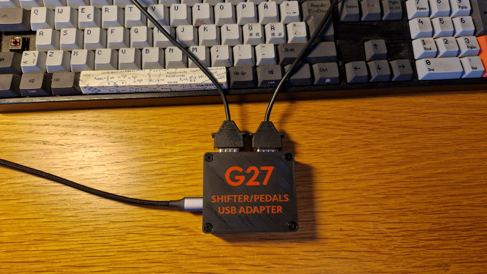
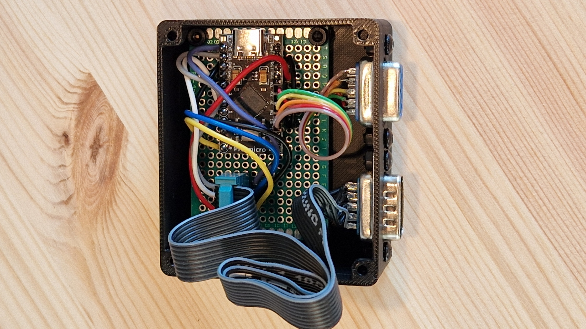
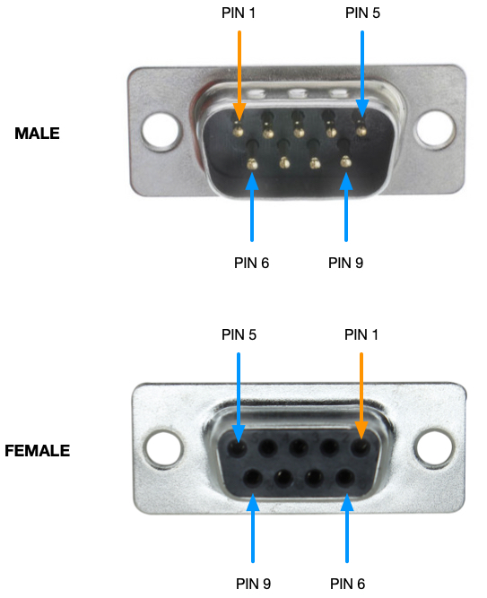
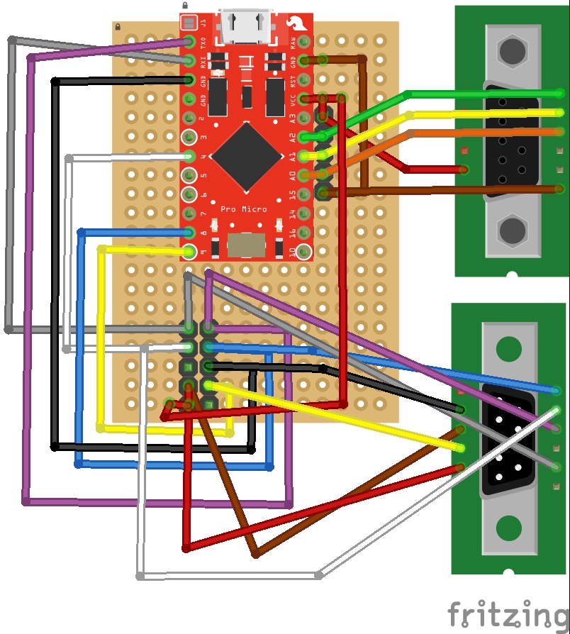
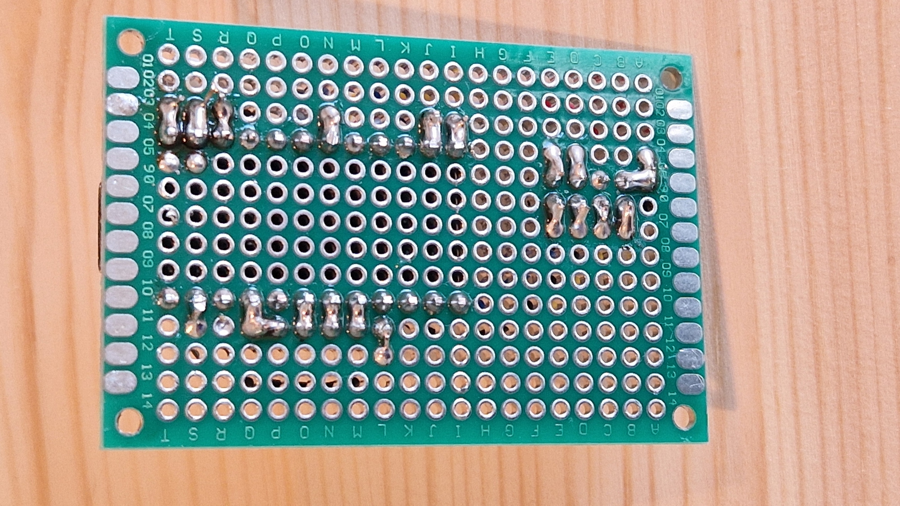
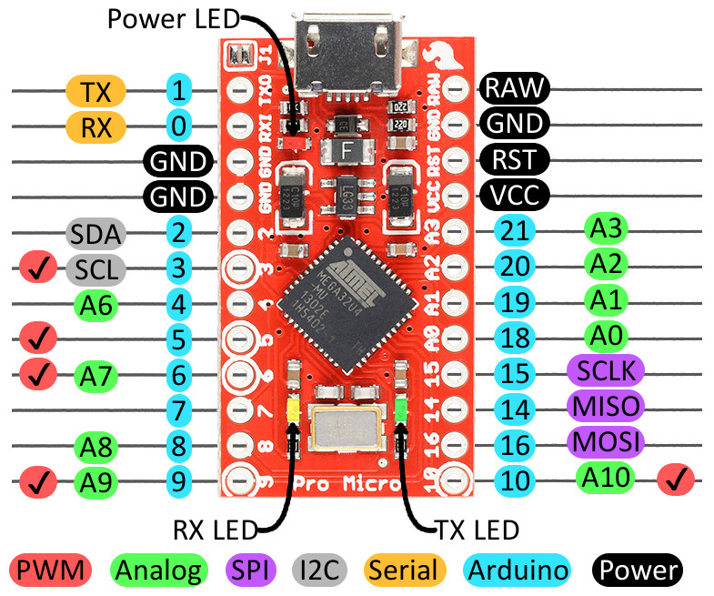

> [!Important]
> **THIS FORK WILL BE DELETED IN A WEEK!**
> 
> The upstream repo currently owned by @n-e-y-s that I have forked this repo from is now maintained by myself (@barsk). Please go to that repo for the latest developments: https://github.com/n-e-y-s/G27_Pedals_and_Shifter

# Logitech G27/G29 Pedals and Shifter USB Adapter
Arduino based USB interface for Logitech G27/G29 pedals and shifter. Note that G29 is not implemented yet (needs another means of entering calibration active mode as button are not there). I will look into it if there is demand.

This is a continuation by @barsk as new collaborator on the works of @n-e-y-s and @functionreturnfunction: https://github.com/functionreturnfunction/G27_Pedals_and_Shifter. 
I have cleaned up a few things, removed the custom Joystick implementation and replaced with the standard Arduino Joystick from MHeironimus (which must be added in Arduino IDE).

> [!Note]
> *The Dpad is now supported as a proper Hat switch (8 directions), instead of 4 buttons!*

I changed throttle, brake and clutch to use the axis Rx, Ry and Z so that the joystick control panel test view in Windows presents these in a better way. That has no impact in games as you can map any axis as throttle, brake and clutch.

I have also made a nice 3D printed box that is included in the CAD folder. Use the 3MF file version of the lid if you have a multi color capable printer for a nice text effect. The STL version prints a solid lid with no text.

Original (older) solution 

## Required Parts/Materials

* [SparkFun Pro Micro](https://www.sparkfun.com/products/12640) or clone (must be a 5V/16MHz ATmega32U4 with onboard USB)
* [DB9 Connectors](http://www.amazon.com/Female-Male-Solder-Adapter-Connectors/dp/B008MU0OR4/ref=sr_1_1?ie=UTF8&qid=1457291922&sr=8-1&keywords=db9+connectors), 1 male, 1 female
* Hookup wire in assorted colors
* Some kind of project box. The new 3D printed box or something as an Altoids tin box.
* The 3D printed box requires the use of a common perfboard type I got on Amazon, which is 60 x 40 mm with 20 rows by 14 columns of holes.

## Assembly

Connect the DB9 pin -> Pro Micro Pin as depicted below.

### Pedal pins (Female connector)
This is the updated wiring suggested by eriknz, which has proper connections to Vcc and GND. 
The pedals need to be inverted in the calibration gui.

Connect the female DB9 connector for the pedals to the board using the pins in the table.
| DB9 | Color                               | Description | Pro Micro   |
| --- | ----------------------------------- | ----------- | ----------- |
| 1   | black                               | GND         | GND         |
| 2   | orange                              | Throttle    | pin 18 (A0) |
| 3   | yellow                              | Brake       | pin 19 (A1) |
| 4   | green                               | Clutch      | pin 20 (A2) |
| 5   |                                     |             |             |
| 6   | connected *in pedals* plug to pin 9 | (+5V)       |             |
| 7   |                                     |             |             |
| 8   |                                     |             |             |
| 9   | red                                 | +5V         | +5V         |

### Shifter pins (Male connector)
| DB9 | Color | Shifter | Description             | Pro Micro   |
| --- | ----------- | ------- | ----------------------- | ----------- |
| 1   | purple      | 7       | Button Data             | pin 1       |
| 3   | white       | 5       | Button !CS & !PL (Mode) | pin 4       |
| 4   | blue        | 3       | Shifter X axis          | pin 8  (A8) |
| 5   | green       | 2       | SPI input               |             |
| 6   | black       | 8       | GND                     | GND         |
| 7   | brown       | 6       | +5V                     | VCC         |
| 8   | yellow      | 4       | Shifter Y axis          | pin 9 (A9)  |
| 9   | red         | 1       | +5V                     | VCC         |

## Perfboard and wiring
If a perfboard is used, which is required to fit the 3D printed box, mount the Micro Pro microprocessor board at the topmost row on the 4th column from the left. That will center the USB connector with the hole in the box. Then use the suggested wiring schematic or come up with your own. The important thing here is that the DB pins are connected to the Micro Pro pins in accordance with the table.

> [!Note]
> The pin 0 and pin 1 (Tx & RX) on the Pro Micro come in reversed order! Easy to swap those wires!

  

## Firmware

Open the .ino file in the Arduino IDE, select the proper board type and COM port under "Tools" (you will need to install the [SparkFun board library](https://github.com/sparkfun/Arduino_Boards)). Also install the Arduino Joystick from MHeironimus.

## Calibration and Configration

After the firmware has been uploaded to the arduino, you want to calibrate and configure the device for your specific device. There is a python based graphical user interface available in this project. 

### GUI installation

#### Using binary releases (windows only)

The easiest method is to download g27calib.zip from the latest release here https://github.com/barsk/G27_Pedals_and_Shifter/releases/latest. Unzip this to a location of your choice and then start g27calib.exe located inside. 

#### Alterantively use python directly

This description assumes a windows operating system (other operating systems are similar; I have tested linux and windows). You need python3 for running this GUI - if you don't have a python3 interpreter on your system already, I suggest to get the interpreter at http://winpython.github.io/. I'd choose the minimal python 3.7 64 bit version, but other versions or distributions should also work. 

The python file *g27calib.py* is in the folder [g27_pedals_and_shifter_gui](g27_pedals_and_shifter_gui). If you have the required libraries installed in Python you may start the tool with:
    
    python g27calib.py

If the tool starts and works, you may also build the .exe (same as in the binary release). First make sure *Pyinstaller* is available and then run Pyinstaller on the supplied spec file.

    pip install pyinstaller
    pyinstaller g27calib.spec

This will create the g27.exe file in the dist subfolder.

#### Other methods
> [!Note]
> This chapter remain from the previous fork and has not been verified by me. I suggest you use the binary release.

When you have a python interpreter in place, I suggest to create a virtual environment using the shell commands:
    
    cd <a path of your choice>
    python -m venv g27calib

This command creates a virtual python environment in the directory g27calib. Afterwards you can install the GUI with 

    .\g27calib\Scripts\pip install git+https://github.com/barsk/G27_Pedals_and_Shifter@master#egg=G27_Pedals_and_Shifter_GUI

Of course you can also specify a local path alternatively to the git path above. Pip downloads some packages from the internet and finally you should be able to start

    g27calib/Scripts/g27calib
    
and the gui should open.

### Calibration process

At first you need to select the Arduino serial device. On linux platforms, it is also necessary to select the joystick device of the G27, otherwise the GUI might be very slow:

When everything is set correctly, press the Start button. You are presented with the calibration/configuration GUI:

On the upper right, you get some help text about what to do next. Using that everything shall be pretty self-explaining. The graphs in the lower part are for the pedals and the shifter respectively. You see the measurements over the last second depicted with the "+" marks. 

> [!Tip]
> When the GUI menstions you should "move" the shifter with the leftmost red button pressed, it means that the areas you are creating with those movements are the *target area* for the shifter positions. Make sure the areas are large enough to cover the position each gear may have as well as the idle postion, and that no area is too close to another to create a false detection. 
When a gear is moved into a target area that will trigger a virtual button to be pressed. Gear 1 pushes button 1 and so on.

The first step is to decide for a suitable filtering. Depending on the wear of your device, the measurements can be quite noisy and so it might be desirable to enable the median filtering in the options panel. When changing the values you will see the immediate effect on the measurements.

Afterwards you probably want at least to calibrate your shifter by selecting the calibration values for the shifter on the upper left panel. Optionally you can also pre-calibrate your pedals such that the values are stored on the Arduino. The default is to use auto-calibration for the pedals.

Note that there is the status line output with some profiling output on the left side and the final output values of the axis, buttons and gear value as delivered to the games. 

Last step is to save the settings to the Arduino's EEPROM using the respective button. You can test that this has been working by going back to the default calibration (plots should change) and then reloading the EEPROM calibration (plots should change to the desired values). Everytime you turn on the Arduino it loads the EEPROM calibration automatically from now on.

## Known issues
* (see here: https://github.com/n-e-y-s/G27_Pedals_and_Shifter/issues/1): On windows, the arduino will be slow after closing the GUI. To fix that, you can unplug the USB connector and then connect again.
* Since we now have implemented Dpad as a Hat switch, the former implementation that triggered the buttons 10-14 still remains, so those buttons are now "dead". This will not cause any problems, since each used button must be bound in-game anyway. I may fix this in a later release. 
